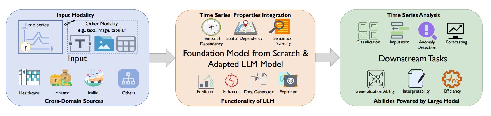
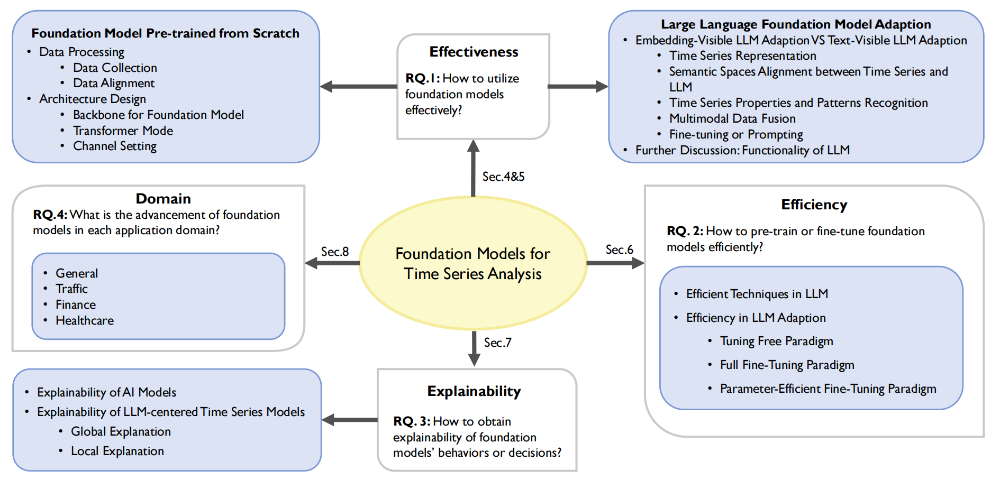

<h1 align="center"> Awesome-Time Series-LLM&FM</h2>
<h5 align="center">AWESOME resources about adapted large language model or foundation model for time series</h5>


<h5 align="center"> If you like our project, please give us a star ⭐ on GitHub for the latest update.</h5>

  [](https://badges.pufler.dev/visits/start2020/Awesome-TimeSeries-LLM-FM)


> This is a collection of papers on **Time Series Foundation Models** , including **pre-training foundation models from scratch for time series** and **adapting large language foundation models for time series**. They both contribute to the development of a unified model that is highly generalizable, versatile, and comprehensible for time series analysis.  It is based on our survey paper: [A Survey of Time Series Foundation Models: Generalizing Time Series Representation with Large Language Model](https://arxiv.org/abs/2405.02358). 
>
> We will try to make this list updated frequently. If you found any error or any missed paper, please don't hesitate to open issues or pull requests.


## How can Time Series Foundation Models help improve time series tasks?

Traditional time series models are task-specific, featuring singular functionality and limited generalization capacity. Recently, large language foundation models have unveiled their remarkable capabilities for cross-task transferability, zero-shot/few-shot learning, and decision-making explainability. This success has sparked interest in the exploration of foundation models to solve multiple time series challenges simultaneously, including knowledge transferability between different time series domains,  data sparseness in some time series scenarios (e.g. business),  multimodal learning between time sequence and other data modality (e.g. text) and explainability of time series models.

<p align="center"></p>
<p align="center"><em>Figure 1.</em> The background of Time Series Foundation Models.</p>


## Summarizations based on proposed taxonomy

<p align="center"></p>
<p align="center"><em>Figure 2.</em> The structure of our survey.</p>

<p align="left"> Our review
is guided by four research questions in Figure 2, covering three analytical dimensions (i.e. effectiveness, efficiency, explainability) and one taxonomy (i.e. domain taxonomy).</p >


## Cite Us

Feel free to cite this survey if you find it useful to you!
```
@article{ye2024survey,
  title={A Survey of Time Series Foundation Models: Generalizing Time Series Representation with Large Language Mode},
  author={Ye, Jiexia and Zhang, Weiqi and Yi, Ke and Yu, Yongzi and Li, Ziyue and Li, Jia and Tsung, Fugee},
  journal={arXiv preprint arXiv:2405.02358},
  year={2024}
}
```


## Table of Contents

- [Foundation Model for Time Series](#FM)
- [Large Language Model for Time Series](#LLM)
  - [General Domain](#gen)
  - [Traffic](#tra)
  - [Finance](#fin)
  - [Healthcare](#hea)

### (1) Foundation Model for Time Series
<a id="FM"></a> 
***
*  [arxiv' 2023] **Toward a Foundation Model for Time Series Data** [[Paper](https://arxiv.org/abs/2310.03916) | [No Code](link)]
    <details close>
    <summary>The Model</summary>
    <p align="center"></p>
    </details>
*  [arxiv' 2023] **A decoder-only foundation model for time-series forecasting** [[Paper](https://arxiv.org/abs/2310.10688) | [No Code](link)]
    <details close>
    <summary>The Model</summary>
    <p align="center"></p>
    </details>

*  [NIPs' 2023] **ForecastPFN: Synthetically-Trained Zero-Shot Forecasting** [[Paper](https://arxiv.org/abs/2311.01933) | [Code](https://github.com/abacusai/forecastpfn)]
  
    <details close>
    <summary>The Model</summary>
    <p align="center"></p>
    </details>

*  [arxiv' 2023] **Lag-Llama: Towards Foundation Models for Time Series Forecasting** [[Paper](https://arxiv.org/abs/2310.08278) | [Code](https://github.com/kashif/pytorch-transformer-ts)]
  
    <details close>
    <summary>The Model</summary>
    <p align="center"></p>
    </details>

*  [arxiv' 2023] **TimeGPT-1** [[Paper](https://arxiv.org/abs/2310.03589) | [No Code](link)]
    <details close>
    <summary>The Model</summary>
    <p align="center"></p>
    </details>

*  [arxiv' 2023] **Only the Curve Shape Matters: Training Foundation Models for Zero-Shot Multivariate Time Series Forecasting through Next Curve Shape Prediction** [[Paper](https://arxiv.org/abs/2402.07570) | [Code](https://github.com/cfeng783/GTT)]
  
    <details close>
    <summary>The Model</summary>
    <p align="center"></p>
    </details>


### (2) Large Language Model for Time Series
<a id="LLM"></a> 
***
#### General Domain
<a id="gen"></a> 
*  [ICLR' 2024] **Time-LLM: Time Series Forecasting by Reprogramming Large Language Models** [[Paper](https://arxiv.org/abs/2310.01728) | [Code](https://github.com/KimMeen/Time-LLM)]
  
    <details close>
    <summary>The Model</summary>
    <p align="center"></p>
    </details>

*  [ICLR' 2024] **TEMPO: Prompt-based Generative Pre-trained Transformer for Time Series Forecasting** [[Paper](https://arxiv.org/abs/2310.04948) | [No Code](Link)]
  
    <details close>
    <summary>The Model</summary>
    <p align="center"></p>
    </details>

*  [ICLR' 2024] **TEST: Text Prototype Aligned Embedding to Activate LLM's Ability for Time Series** [[Paper](https://arxiv.org/abs/2308.08241) | [No Code](Link)]
  
    <details close>
    <summary>The Model</summary>
    <p align="center"></p>
    </details>

*  [WWW' 2024] **UniTime: A Language-Empowered Unified Model for Cross-Domain Time Series Forecasting** [[Paper](https://arxiv.org/abs/2310.09751) | [No Code](Link)]
  
    <details close>
    <summary>The Model</summary>
    <p align="center"></p>
    </details>


*  [arXiv' 2023] **LLM4TS: Two-Stage Fine-Tuning for Time-Series Forecasting with Pre-Trained LLMs** [[Paper](https://arxiv.org/abs/2308.08469) | [No Code](Link)]
  
    <details close>
    <summary>The Model</summary>
    <p align="center"></p>
    </details>


*  [arXiv' 2023] **The first step is the hardest: Pitfalls of Representing and Tokenizing Temporal Data for Large Language Models** [[Paper](https://arxiv.org/abs/2309.06236) | [No Code](Link)]
  
    <details close>
    <summary>The Model</summary>
    <p align="center"></p>
    </details>

*  [TKDE' 2023] **PromptCast: A New Prompt-based Learning Paradigm for Time Series Forecasting** [[Paper](https://arxiv.org/abs/2210.08964) | [Code](https://github.com/HaoUNSW/PISA)]
  
    <details close>
    <summary>The Model</summary>
    <p align="center"></p>
    </details>

*  [NeurIPS' 2023] **One Fits All: Power General Time Series Analysis by Pretrained LM** [[Paper](https://arxiv.org/abs/2302.11939) | [Code](https://github.com/DAMO-DI-ML/NeurIPS2023-One-Fits-All)]
  
    <details close>
    <summary>The Model</summary>
    <p align="center"></p>
    </details>

*  [NeurIPS' 2023] **Large Language Models Are Zero-Shot Time Series Forecasters** [[Paper](https://arxiv.org/abs/2310.07820) | [Code](https://github.com/ngruver/llmtime)]
  
    <details close>
    <summary>The Model</summary>
    <p align="center"></p>
    </details>


***
#### Traffic
<a id="tra"></a> 
*  [arXiv' 2023] **Where Would I Go Next? Large Language Models as Human Mobility Predictors** [[Paper](https://arxiv.org/abs/2308.15197) | [Code](https://github.com/xlwang233/LLM-Mob)]
  
    <details close>
    <summary>The Model</summary>
    <p align="center"></p>
    </details>

*  [SIGSPATIAL' 2022] **Leveraging Language Foundation Models for Human Mobility Forecasting** [[Paper](https://arxiv.org/abs/2209.05479) | [Code](https://github.com/cruiseresearchgroup/AuxMobLCast)]
  
    <details close>
    <summary>The Model</summary>
    <p align="center"></p>
    </details>

***
#### Finance
<a id="fin"></a> 
*  [arXiv' 2023] **Temporal Data Meets LLM -- Explainable Financial Time Series Forecasting** [[Paper](https://arxiv.org/abs/2306.11025) | [No Code](Link)]
  
    <details close>
    <summary>The Model</summary>
    <p align="center"></p>
    </details>


*  [arXiv' 2023] **The Wall Street Neophyte: A Zero-Shot Analysis of ChatGPT Over MultiModal Stock Movement Prediction Challenges** [[Paper](https://arxiv.org/abs/2304.05351) | [No Code](Link)]
  
    <details close>
    <summary>The Model</summary>
    <p align="center"></p>
    </details>

***
#### Healthcare
<a id="hea"></a> 

*  [arXiv' 2023] **Large Language Models are Few-Shot Health Learners** [[Paper](https://arxiv.org/abs/2305.15525) | [No Code](Link)]
  
    <details close>
    <summary>The Model</summary>
    <p align="center"></p>
    </details>

***
## Contributing

If you have come across relevant resources, feel free to open an issue or submit a pull request.
