<h1 align="center"> Awesome-Time Series-LLM&FM</h2>
<h5 align="center">AWESOME resources about adapted large language model or foundation model for time series</h5>

<h5 align="center"> If you like our project, please give us a star ⭐ on GitHub for the latest update.</h5>

  [](https://badges.pufler.dev/visits/start2020/Awesome-TimeSeries-LLM-FM)

## Cite Us

Feel free to cite this survey if you find it useful to you!
```
@article{,
  title={}, 
  author={},
  journal={},
  year={}
}
```


## Table of Contents

- [Foundation Model for Time Series](#FM)
  - 


### Foundation Model for Time Series

<a id="FM"></a> 

*  [arxiv' 2023] **Toward a Foundation Model for Time Series Data** [[Paper](https://arxiv.org/abs/2310.03916) | [No Code](link)]
  <details close>
  <summary>The Model</summary>
  <p align="center">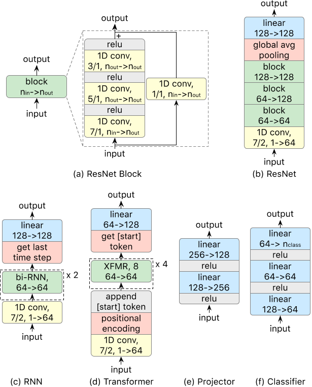</p>
  </details>
*  [arxiv' 2023] **A decoder-only foundation model for time-series forecasting** [[Paper](https://arxiv.org/abs/2310.10688) | [No Code](link)]
  
  <details close>
  <summary>The Model</summary>
  <p align="center">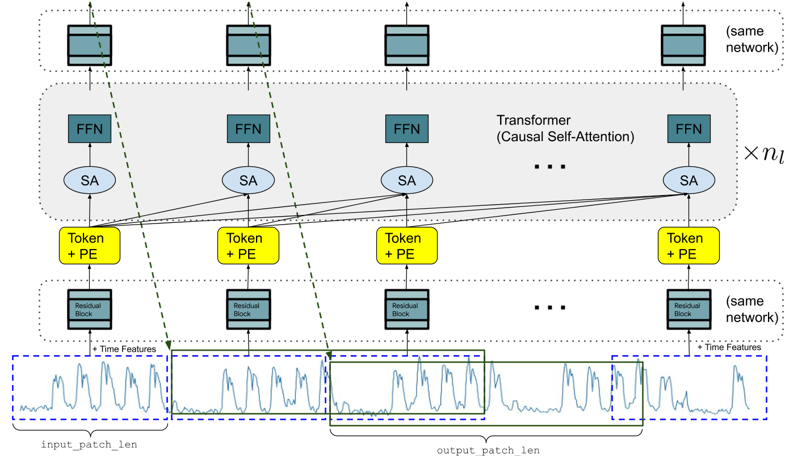</p>
  </details>
*  [NIPs' 2023] **ForecastPFN: Synthetically-Trained Zero-Shot Forecasting** [[Paper](https://arxiv.org/abs/2311.01933) | [Code](https://github.com/abacusai/forecastpfn)]
  
  <details close>
  <summary>The Model</summary>
  <p align="center">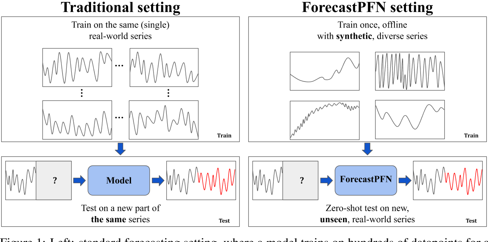</p>
  </details>
*  [arxiv' 2023] **Lag-Llama: Towards Foundation Models for Time Series Forecasting** [[Paper](https://arxiv.org/abs/2310.08278) | [Code](https://github.com/kashif/pytorch-transformer-ts)]
  
  <details close>
  <summary>The Model</summary>
  <p align="center">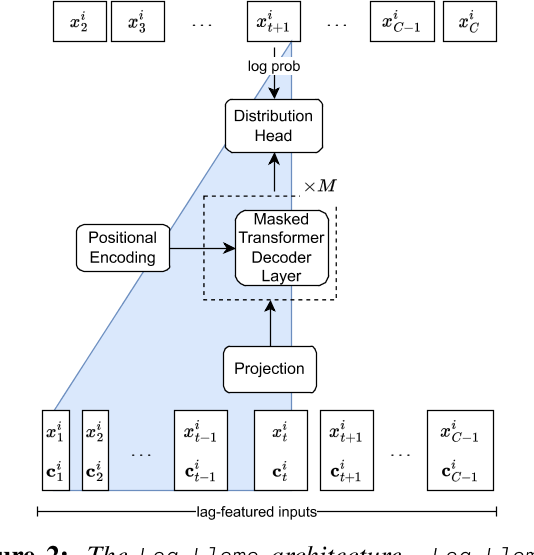</p>
  </details>
*  [arxiv' 2023] **TimeGPT-1** [[Paper](https://arxiv.org/abs/2310.03589) | [No Code](link)]
  <details close>
  <summary>The Model</summary>
  <p align="center">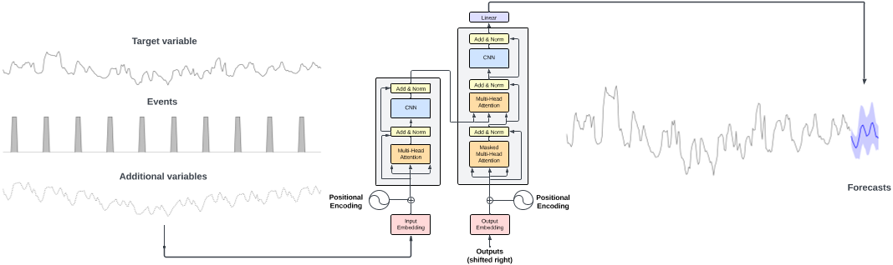</p>
  </details>
*  [arxiv' 2023] **Only the Curve Shape Matters: Training Foundation Models for Zero-Shot Multivariate Time Series Forecasting through Next Curve Shape Prediction** [[Paper](https://arxiv.org/abs/2402.07570) | [Code](https://github.com/cfeng783/GTT)]
  
  <details close>
  <summary>The Model</summary>
  <p align="center">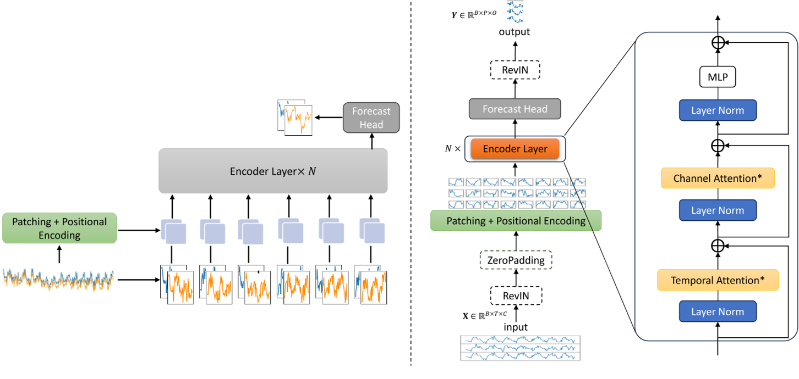</p>
  </details>


### Large Language Model for Time Series

##### General Domain

*  [ICLR' 2024] **Time-LLM: Time Series Forecasting by Reprogramming Large Language Models** [[Paper](https://arxiv.org/abs/2310.01728) | [Code](https://github.com/KimMeen/Time-LLM)]
  
  <details close>
  <summary>The Model</summary>
  <p align="center">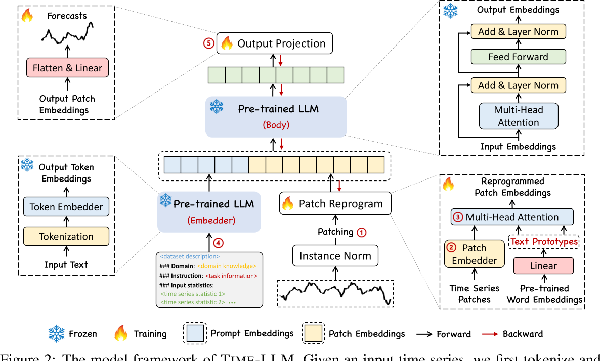</p>
  </details>
*  [ICLR' 2024] **TEMPO: Prompt-based Generative Pre-trained Transformer for Time Series Forecasting** [[Paper](https://arxiv.org/abs/2310.04948) | [No Code](Link)]
  
  <details close>
  <summary>The Model</summary>
  <p align="center">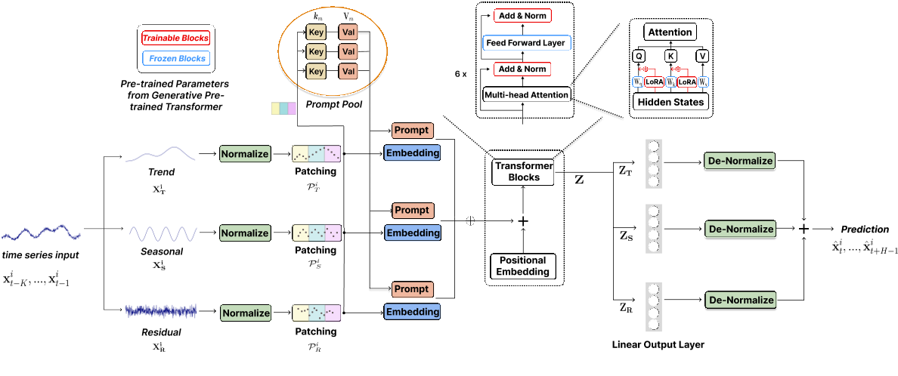</p>
  </details>
*  [ICLR' 2024] **TEST: Text Prototype Aligned Embedding to Activate LLM's Ability for Time Series** [[Paper](https://arxiv.org/abs/2308.08241) | [No Code](Link)]
  
  <details close>
  <summary>The Model</summary>
  <p align="center">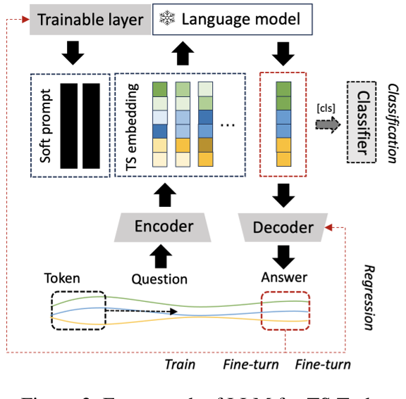</p>
  </details>
*  [WWW' 2024] **UniTime: A Language-Empowered Unified Model for Cross-Domain Time Series Forecasting** [[Paper](https://arxiv.org/abs/2310.09751) | [No Code](Link)]
  
  <details close>
  <summary>The Model</summary>
  <p align="center">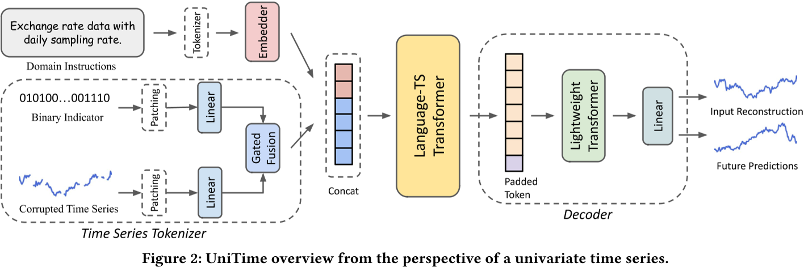</p>
  </details>
*  [arXiv' 2023] **LLM4TS: Two-Stage Fine-Tuning for Time-Series Forecasting with Pre-Trained LLMs** [[Paper](https://arxiv.org/abs/2308.08469) | [No Code](Link)]
  
  <details close>
  <summary>The Model</summary>
  <p align="center">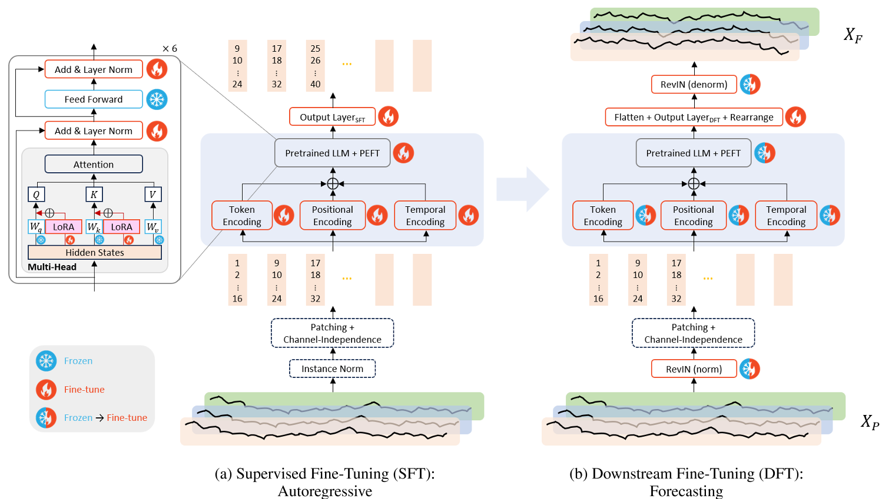</p>
  </details>
*  [arXiv' 2023] **The first step is the hardest: Pitfalls of Representing and Tokenizing Temporal Data for Large Language Models** [[Paper](https://arxiv.org/abs/2309.06236) | [No Code](Link)]
  
  <details close>
  <summary>The Model</summary>
  <p align="center">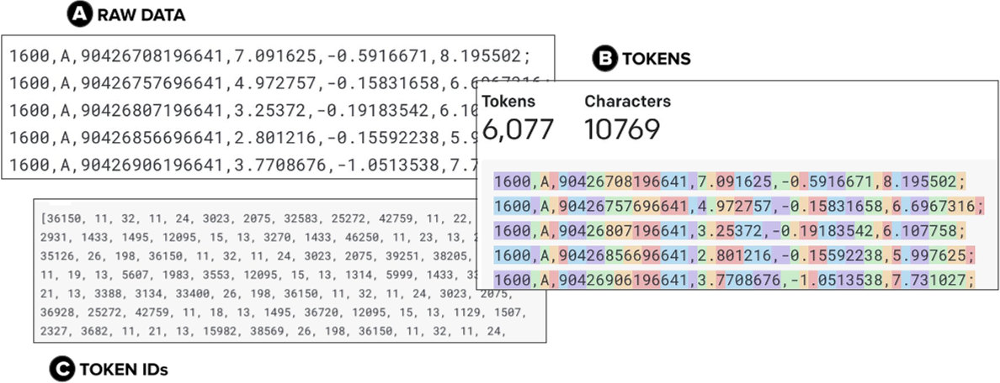</p>
  </details>
*  [TKDE' 2023] **PromptCast: A New Prompt-based Learning Paradigm for Time Series Forecasting** [[Paper](https://arxiv.org/abs/2210.08964) | [Code](https://github.com/HaoUNSW/PISA)]
  
  <details close>
  <summary>The Model</summary>
  <p align="center">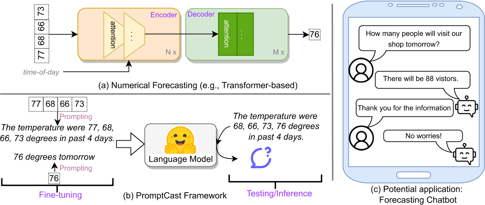</p>
  </details>
*  [NeurIPS' 2023] **One Fits All: Power General Time Series Analysis by Pretrained LM** [[Paper](https://arxiv.org/abs/2302.11939) | [Code](https://github.com/DAMO-DI-ML/NeurIPS2023-One-Fits-All)]
  
  <details close>
  <summary>The Model</summary>
  <p align="center">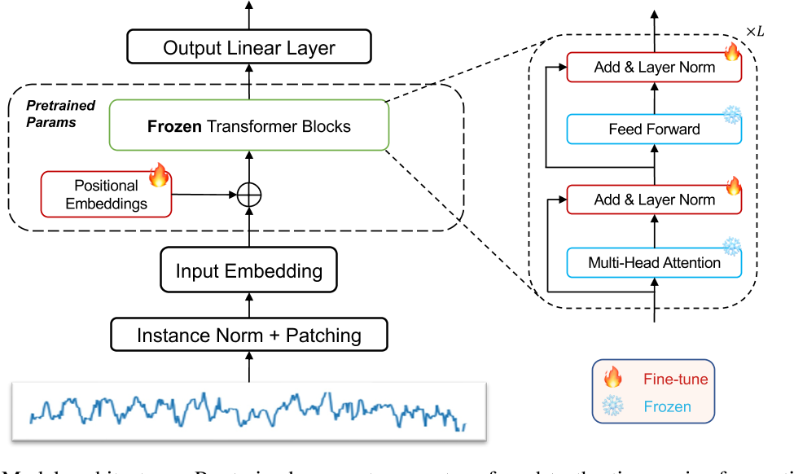</p>
  </details>
*  [NeurIPS' 2023] **Large Language Models Are Zero-Shot Time Series Forecasters** [[Paper](https://arxiv.org/abs/2310.07820) | [Code](https://github.com/ngruver/llmtime)]
  
  <details close>
  <summary>The Model</summary>
  <p align="center">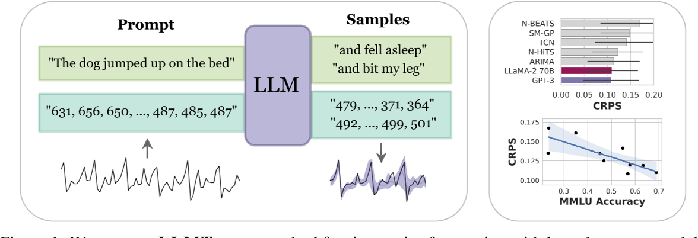</p>
  </details>


##### Traffic

*  [arXiv' 2023] **Where Would I Go Next? Large Language Models as Human Mobility Predictors** [[Paper](https://arxiv.org/abs/2308.15197) | [Code](https://github.com/xlwang233/LLM-Mob)]
  
  <details close>
  <summary>The Model</summary>
  <p align="center">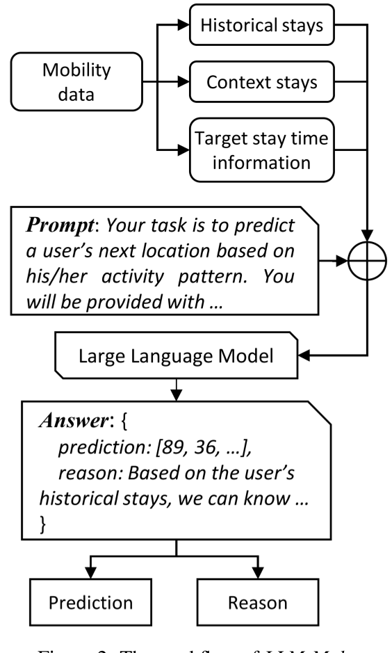</p>
  </details>
*  [SIGSPATIAL' 2022] **Leveraging Language Foundation Models for Human Mobility Forecasting** [[Paper](https://arxiv.org/abs/2209.05479) | [Code](https://github.com/cruiseresearchgroup/AuxMobLCast)]
  
  <details close>
  <summary>The Model</summary>
  <p align="center">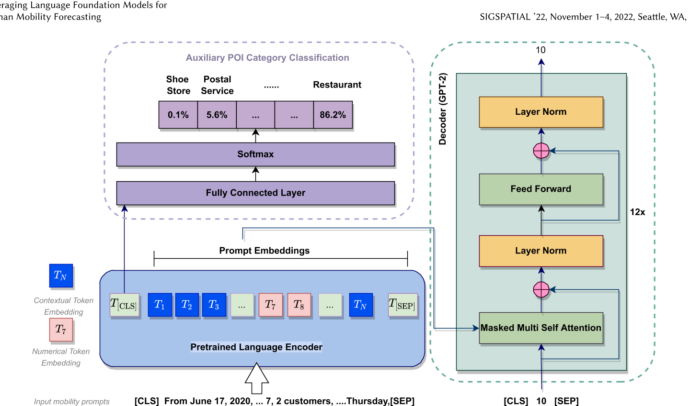</p>
  </details>

##### Finance

*  [arXiv' 2023] **Temporal Data Meets LLM -- Explainable Financial Time Series Forecasting** [[Paper](https://arxiv.org/abs/2306.11025) | [No Code](Link)]
  
  <details close>
  <summary>The Model</summary>
  <p align="center">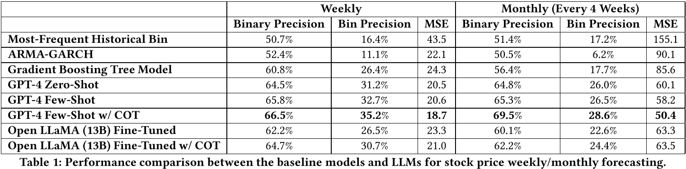</p>
  </details>
  
*  [arXiv' 2023] **The Wall Street Neophyte: A Zero-Shot Analysis of ChatGPT Over MultiModal Stock Movement Prediction Challenges** [[Paper](https://arxiv.org/abs/2304.05351) | [No Code](Link)]
  
  <details close>
  <summary>The Model</summary>
  <p align="center"></p>
  </details>

##### Healthcare

*  [arXiv' 2023] **Large Language Models are Few-Shot Health Learners** [[Paper](https://arxiv.org/abs/2305.15525) | [No Code](Link)]
  
  <details close>
  <summary>The Model</summary>
  <p align="center">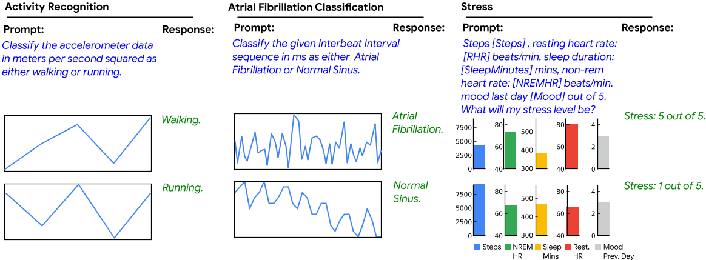</p>
  </details>


## Contributing

If you have come across relevant resources, feel free to open an issue or submit a pull request.
